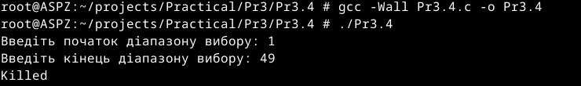

# Практична робота №3
Цей репозиторій cтворений для перегляду виконання практичної роботи №3 з дисципліни "Архітектура системного програмного забезпечення", виконане студентом Щур Р.І., групи ТВ-32.

## Завдання №1
Запустіть Docker-контейнер і поекспериментуйте з максимальним лімітом ресурсів відкритих файлів. Для цього виконайте команди у вказаному порядку:

## Виконання

Виконавши команди, видно, що при стандартних налаштуваннях Docker неможливо встановити soft ліміт, який перевищує hard ліміт; його можна змінювати лише в межах hard ліміту.

Запустивши Docker-контейнер з root правами, я не помітив змін
## Завдання №2
У Docker-контейнері встановіть утиліту perf(1). Поекспериментуйте з досягненням процесом встановленого ліміту.

## Виконання

## Завдання №3
Напишіть програму, що імітує кидання шестигранного кубика. Імітуйте кидки, результати записуйте у файл, для якого попередньо встановлено обмеження на його максимальний розмір (max file size). Коректно обробіть ситуацію перевищення ліміту.

## Виконання

Для імітації кидка кубика я використав функцію rand. Щоб обмежити розмір файлу, створив функцію get_size, яка отримує значення розміру файлу, використовуючи бібліотеку sys/stat.h, та повертає його розмір у головну функцію. Там до цього розміру додається розмір нових даних і порівнюється з константою MAX_FILE_SIZE. Якщо MAX_FILE_SIZE менший за об'єм нових даних плюс об'єм старих даних, то програма виводить повідомлення про неможливість записати нові дані. Якщо ж MAX_FILE_SIZE  більший, то програма виконує запис
## Завдання №4
Напишіть програму, що імітує лотерею, вибираючи 7 різних цілих чисел у діапазоні від 1 до 49 і ще 6 з 36. Встановіть обмеження на час ЦП (max CPU time) і генеруйте результати вибору чисел (7 із 49, 6 із 36). Обробіть ситуацію, коли ліміт ресурсу вичерпано.

## Виконання

Для встановлення обмеження на час ЦП, я застосувала функцію setrlimit з бібліотеки sys/resource.h. Я встановила ліміт на час ЦП в 1 секунду. У разі перевищення цього ліміту операційна система надсилає процесу сигнал SIGXCPU.
Щоб обробити сигнал SIGXCPU, я створила функцію timeout_handler. Ця функція, отримавши сигнал про перевищення ліміту часу ЦП, виводить повідомлення "Час вийшов!" і завершує програму. (Якщо час справді вийшов, програма завершується, не встигнувши виконати функцію timeout_handler тому у цьому випадку функція безкорисна). Для виклику використання ліміту додав великий цикл, щоб навантажити систему.
## Завдання №5
Напишіть програму для копіювання одного іменованого файлу в інший. Імена файлів передаються у вигляді аргументів.
Програма має:

-Перевіряти, чи передано два аргументи, інакше виводити "Program need two arguments";

-Перевіряти доступність першого файлу для читання, інакше виводити "Cannot open file .... for reading";

-Перевіряти доступність другого файлу для запису, інакше виводити "Cannot open file .... for writing";

-Обробляти ситуацію перевищення обмеження на розмір файлу.

## Виконання

Щоб перевірити, чи розмір файлу з якого братимуться дані не перевищує встановлений ліміт, я використав функцію get_size з завдання №3. Якщо розмір файлу перевищує ліміт, програма виводить повідомлення про помилку і завершується.
Якщо розмір файлу в межах ліміту, програма починає копіювання. У циклі while з вхідного файлу зчитується блок даних розміром до 1024 байт за допомогою функції fread. Зчитані дані записуються у вихідний файл за допомогою функції fwrite. Після кожної операції запису проводиться перевірка на наявність помилок, щоб переконатися, що всі дані були успішно записані. Якщо під час запису виникає помилка, програма виводить повідомлення про помилку, закриває обидва файли і завершується.Перед початком роботи програма перевіряє, чи отримала вона два обов'язкові параметри.
## Завдання №6
Напишіть програму, що демонструє використання обмеження (max stack segment size). Підказка: рекурсивна програма активно використовує стек.

## Виконання

Для демонстрації обмеження max stack segment size я створив рекурсивну функцію. В кожному виклику цієї функції оголошується локальна змінна типу int local. Оскільки local є локальною змінною, вона розміщується в стеку. При кожному рекурсивному виклику, новий екземпляр змінної займає місце в стеку. Зі збільшенням рекурсії, стек поступово заповнюється. Коли стек досягає max stack segment size, спроба виділити додаткове місце для нової змінної local призводить до переповнення стека segmentation fault
## Завдання №7
Перепишіть наступний код, використовуючи reallocarray(3):

Порівняйте результати виконання з використанням ltrace.
